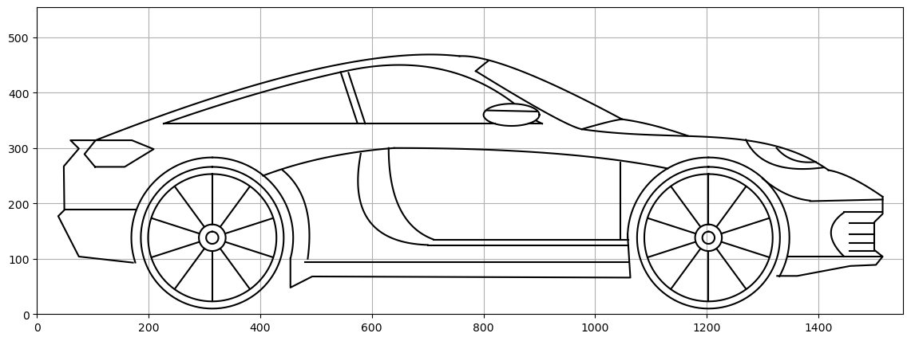
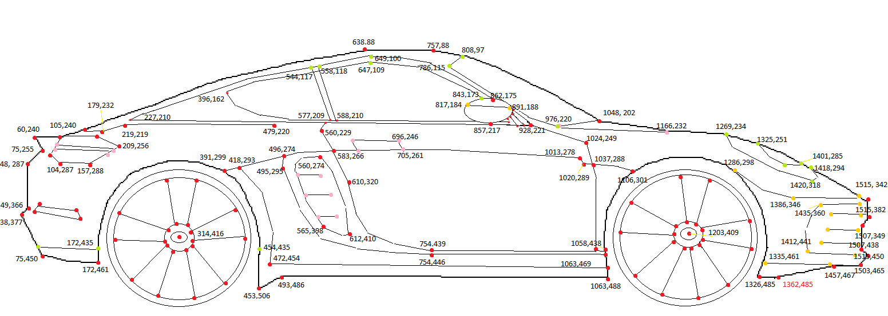

# bezier-porsche-plotting
🏁 Realizando a plotagem de um Porsche utilizando curvas de Bézier e geometria analítica.

 

## Processo de criação

### 1. **Utilizando uma imagem como referência**

Primeiramente, foi utilizado um modelo de Porsche como referência para o processo de modelagem.

 

### 2. **Utilizando uma representação abstraída**

A partir da imagem de referência, foi criada uma representação simplificada e abstraída do modelo original, utilizando um software convencional de desenho livre.

 

### 3. **Mapeamento de coordenadas**

A partir do desenho obtido pela imagem de referência, foi possível mapear todos os pontos referentes às coordenadas do Porsche original, permitindo a modelagem de suas partes utilizando técnicas de geometria analítica.

 

### 4. **Modelagem e plotagem**

Possuindo as coordenadas que permitem a construção do Porsche, foi possível modelar toda a criação do veículo em partes, utilizando curvas de Bézier, linhas, circunferências e outras técnicas de geometria analítica, plotando a figura ao final do processo.

 

## Autores
- Gabriel Przytocki ([@gprzy](https://github.com/gprzy));
- Gustavo Klinfuss ([@GustavoKlinfuss](https://github.com/GustavoKlinfuss));